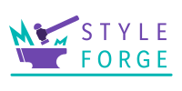

<p align="center">
  
</p>
<p align="center">Build "design-first" design systems</p>

# Style Forge

### A design-to-code conversion tool

Style Forge is a Figma-based tool that truly makes Figma the source of truth for a design system.

Convert Figma files into JSON objects, ready to integrate with style systems such as styled-components or Emotion.

## Table of Contents

- [Install](#install)
- [Usage](#usage)

### Install

To install Style Forge in your project with npm:

```
npm i @monsterww/style-forge
```

To install Style Forge in your project with yarn:

```
yarn add @monsterww/style-forge
```

### Usage

To create a theme:

```
import { StyleForge } from '@monsterww/style-forge';

...

const theme = StyleForge.getThemeData(token, fileId);
```

The basic `getThemeData` call takes two props:

- **figmaToken** - the [Figma Personal Access Token](https://help.figma.com/hc/en-us/articles/8085703771159-Manage-personal-access-tokens) to use
- **figmaFileKey** - the identifying key for the Figma file to parse. This can be found in the Figma file's URL.


# Logo Credits

Creative Commons Attribution

“noun-ball-plan-hammer” by Pascal Hess / CC by 3.0

https://thenounproject.com/icon/ball-plan-hammer-3463748/
https://thenounproject.com/hess_pascal/
https://creativecommons.org/licenses/by/3.0/us/legalcode

---

“noun-metalworking” by Symbolon / CC by 3.0

https://thenounproject.com/icon/metalworking-1561383/
https://thenounproject.com/symbolon/
https://creativecommons.org/licenses/by/3.0/us/legalcode 


